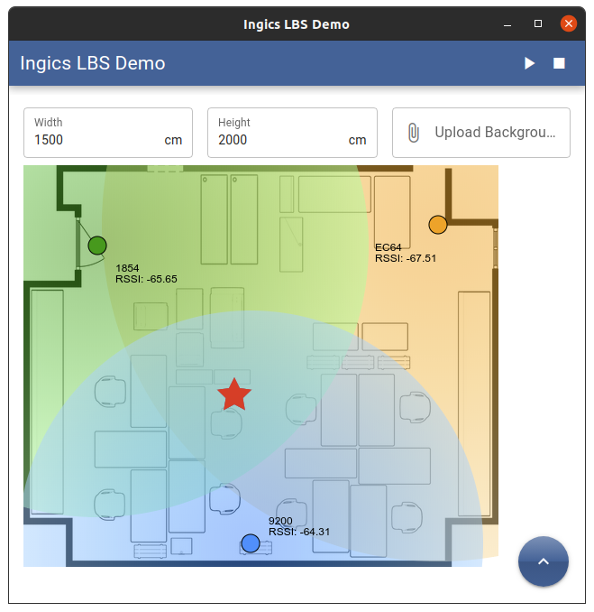

# Ingics LBS Demo (ingics-lbs-demo)

LBS demonstration with iGSXX.



### Requirement

-   iBSXX Beacon for tracking
-   iGS01S/iGS03 Beacon Gateway \* 3
    -   Support PlainText format
    -   Support M2M Server or MQTT mode
-   A PC for compile and running this application
    -   Tested with Ubuntu 22
        -   NodeJS v16.20.2
        -   NodeJS v18.19.1
        -   NodeJS v20.11.1
    -   Quasar/Electron/NodeJS project should be runnable on Windows environment, but not officially tested
-   A MQTT broker if iGS01/iGS03 use MQTT transfer

### Install Quasar Cli

This application is implemented using Quasar (v2) framework.
You will need to install Quasar CLI for running the application.

-   https://quasar.dev/start/quasar-cli

### Install the dependencies

```bash
npm install
```

### Start the app in development mode

```bash
quasar dev -m electron
```

### Quick Start Up

1. Upload background image (floorplan image)
2. Setup the image scale (real width & height)
3. Add 3 gateways (you can drag & drop the gateway location after added) (\*)
4. Click start button on right-top
5. Select tracking beacon, the estimate location will show on screen

### Code Reference

Most code relative to location is in [src/store/gateway/mutations.js](src/store/gateway/mutations.js).

#### Kalman Filter

The RSSI value is quite variant caused by environment noise. I use Kalman Filter to smooth the RSSI readings for estimate the distance between gateway and beacon in this project.

Normally you will need to consider your target system to adjust different parameter or use different filter algorithm.

#### RSSI to Distance

The formula is

$$RSSI = -20*\log_{10}D + RssiRef_{1M}$$

so..

$$D = 10^{(RssiRef_{1M} - RSSI)/20}$$

#### Calculate Location $(x,y)$

Assume gateway location are ($x_1,y_1$), ($x_2,y_2$), ($x_3,y_3$), and the distance (calculated by RSSI) between beacon and gateways are $d_1,d_2,d_3$. Formula for gateway $i$ will be:

$$(x-x_i)^2+(y-y_i)^2=d_i^2$$

$$\rightarrow x^2 - 2xx_i + x_i^2 + y^2 - 2yy_i + y_i^2 = d_i^2$$

Combine the formula for two gateways $(i,j)$ will be

$$d_i^2-d_j^2 = -2xx_i + 2xx_j + x_i^2 - x_j^2 - 2yy_i + 2yy_j + y_i^2 - y_j^2 $$

$$\rightarrow d_i^2-d_j^2 - x_i^2 + x_j^2 - y_i^2 + y_j^2 = 2x(x_j - x_i) + 2y(y_j - y_i) $$

List formulas for $(d_1-d_2),(d_1-d_3),(d_2-d_3)$, and convert to matrix formula:

```math
\begin{bmatrix}
2(x_2-x_1)&2(y_2-y_1)\\
2(x_3-x_1)&2(y_3-y_1)\\
2(x_3-x_2)&2(y_3-y_2)
\end{bmatrix}
\begin{bmatrix}
x\\
y
\end{bmatrix} =
\begin{bmatrix}
d^2_1-d^2_2-x^2_1+x^2_2-y^2_1+y^2_2\\
d^2_1-d^2_3-x^2_1+x^2_3-y^2_1+y^2_3\\
d^2_2-d^2_2-x^2_2+x^2_2-y^2_2+y^2_2
\end{bmatrix}
```

Mark above foumla as

$$Ax = b$$

$$\rightarrow x = A^tb$$

$$\rightarrow x = (A^TA)^{-1}A^Tb$$


Simbols in above formula:

$$A^T: Transpose Matrix$$

$$A^{-1}: Inverse Matrix$$

$$I: Identity matrix (AA^{-1}=I)$$

$$A^t: Pseudo Inverse Matrix ((A^TA)^{-1}A^T=A^t)$$

The NodeJS <b>ml-matrix</b> package provides the methods for transpose matrix and inverse matrix, so, we can get the pseudo matrix and then find the result $[x,y]$.

### Caution \*\*\*

The location algorithm used in this project has not been extensively tested and adjusted to prove its correctness. The purpose of this project is try to provide a reference that how to estimate the beacon location by gateway RSSI reading.
